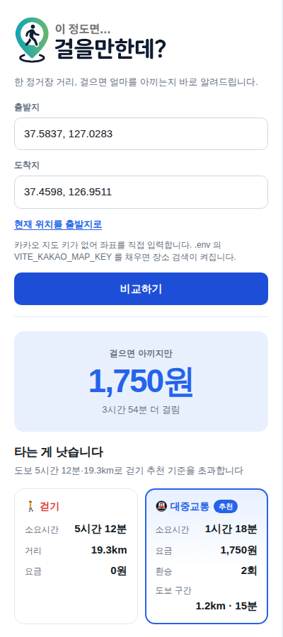
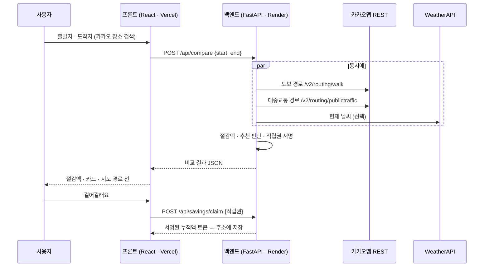

<p align="center">
  
</p>

<p align="center">
  <b>한 정거장 거리, 걸을까 탈까?</b><br>
  도보와 대중교통을 나란히 비교해서 <b>걸으면 얼마를 아끼는지</b> 바로 보여 주는 웹서비스
</p>

<p align="center">
  <a href="https://walkride-fe.vercel.app"><b>🚀 서비스 열어 보기</b></a>
  &nbsp;·&nbsp;
  <a href="https://app.notion.com/p/3d983d12110281069eacc6d352e46517">📚 기획 · 명세 (Notion)</a>
  &nbsp;·&nbsp;
  <a href="https://github.com/NewbieThon-KOREA-Univ-26/FE-BE">💻 GitHub</a>
</p>

<p align="center">2026 뉴비톤 · 32조</p>

---

## 30초 소개

| | |
| --- | --- |
| **문제** | 한두 정거장 거리에서 "탈까, 걸을까" 망설이지만 **걸으면 얼마를 아끼는지** 감이 없다 |
| **해결** | 출발지·도착지만 넣으면 **도보 vs 대중교통**을 나란히 보여 주고, 절감액을 가장 크게 띄운다 |
| **판단** | 도보 **30분·2km 이내**면 걷기 추천. 비·더위·추위면 기준을 절반으로 낮춘다 |
| **기록** | "걸어갈래요"를 누를 때마다 절감액이 쌓인다. 로그인 없이, 주소 하나로 |

## 화면

| 비교 결과 | 승차·하차 안내 | 모바일 |
| :---: | :---: | :---: |
|  |  |  |
| 절감액 · 걷기 vs 대중교통 · 한 줄 결론 | 대중교통 카드를 누르면 아래로 펼쳐짐 | 지도 위에 뜨는 카드 구조 |

## 핵심 기능

| | 기능 | 구현 | 상태 |
| --- | --- | --- | --- |
| F1 | 출발지·도착지 입력 | 카카오 장소 검색, 현재 위치 버튼 | ✅ |
| F2 | 대중교통 경로 | 소요시간 · 요금 · 환승 · 걷는 구간 · **호선/버스번호별 승하차 안내** | ✅ |
| F3 | 도보 경로 | 소요시간 · 거리 · 지도 위 경로 선 | ✅ |
| F4 | 절감액 계산 | 대중교통 요금 − 0원, 더 걸리는 시간 | ✅ |
| F5 | 비교 결과 화면 | 절감액 크게 · 카드 나란히 · 한 줄 결론 | ✅ |
| F6 | 날씨 반영 | 비·눈 / 강수확률 60%↑ / 30°C↑ / -5°C↓ 면 걷기 기준 절반 | ✅ |
| F7 | 소모 열량 | 화면만 준비, 계산 미구현 | ⏳ |
| F8 | 절감액 누적 | 서버가 서명한 토큰을 주소(`?t=`)에 저장 — 고치면 0 으로 | ✅ |
| F9 | 절감액 적립 | "걸어갈래요" → 1회용 적립권으로 서버가 적립 → 팝업 | ✅ |

## 어떻게 동작하나



- 경로 조회는 **백엔드**가 합니다. 카카오 REST 키는 비밀이고, 브라우저에서 직접 부르면 CORS 에 막히기 때문입니다.
- 도보와 대중교통, 날씨는 **동시에** 묻습니다. 날씨는 실패해도 비교를 막지 않습니다.

## 기술 스택

| 영역 | 사용 |
| --- | --- |
| 프론트 | React 19 · TypeScript · Vite 8 · 카카오 지도 JavaScript SDK |
| 백엔드 | Python 3.13 · FastAPI · httpx · pydantic-settings |
| 외부 API | 카카오맵 REST (도보 · 대중교통 경로) · WeatherAPI.com (날씨) |
| 배포 | Vercel (프론트) · Render (백엔드) |
| 테스트 | 백엔드 282개 (unittest) · 헤드리스 브라우저 검증 (Playwright) |

## 빠른 시작

```bash
# 1. 백엔드
cd backend
python -m venv .venv && .venv/bin/pip install -r requirements.txt
cp .env.example .env              # KAKAO_REST_API_KEY 채우기
.venv/bin/uvicorn main:app --reload --port 8000

# 2. 프론트 (새 터미널)
cd frontend
npm install
cp .env.example .env              # VITE_KAKAO_MAP_KEY 채우고 VITE_API_BASE_URL=http://localhost:8000
npm run dev                       # http://localhost:5173
```

키 없이 화면만 보려면 `frontend/.env` 에 `VITE_USE_MOCK=true` 를 두면 예시 응답으로 동작합니다.

## 배포 설정 요약

| 어디 | 변수 | 값 |
| --- | --- | --- |
| Vercel (프론트) | `VITE_KAKAO_MAP_KEY` | 카카오 **JavaScript** 키 |
| | `VITE_API_BASE_URL` | 백엔드 주소 (Render) |
| | `VITE_USE_MOCK` | `false` |
| Render (백엔드) | `KAKAO_REST_API_KEY` | 카카오 **REST** 키 |
| | `CORS_ORIGINS` | `https://walkride-fe.vercel.app,http://localhost:5173` |
| | `WEATHER_API_KEY` | WeatherAPI.com 키 (없으면 날씨 없이 동작) |
| | `SESSION_SECRET_KEY` | 절감액 토큰 서명 비밀 (`render.yaml` 이 자동 생성) |

> 카카오 키 두 개는 서로 다릅니다. `VITE_` 로 시작하는 값은 브라우저에 노출되므로 REST 키를 넣으면 안 됩니다.
> Render 설정과 문제 해결은 [backend/README.md](backend/README.md), 프론트 환경변수는 [frontend/README.md](frontend/README.md) 에 있습니다.

## API 한눈에

| 메서드 | 경로 | 하는 일 |
| --- | --- | --- |
| `POST` | `/api/compare` | `{start, end}` 좌표 → 도보·대중교통 비교, 절감액, 추천, 날씨, 적립권 |
| `GET` | `/api/savings?total=…` | 누적액 토큰 검증 |
| `POST` | `/api/savings/claim` | 적립권 소모 → 새 누적액 토큰 |
| `GET` | `/api/health` | 서버 상태 |

요청·응답 필드와 에러 코드는 [API 명세서 (Notion)](https://app.notion.com/p/3d983d12110280cbb5cac7707e2863a6) 에 있습니다.

## 안전장치

- **절감액 위조 방지** — 누적액은 서버 서명 토큰, 적립은 1회용 적립권. 주소창에서 숫자를 고쳐도 0 으로 돌아갑니다
- **남용 방지** — IP 당 분당 60회 제한, 같은 구간 2분 캐시, 직선 30km 초과는 조회하지 않음
- **키는 서버에만** — 오류 메시지에 키·업스트림 본문을 담지 않음 (테스트로 고정)
- **오류는 사람 말로** — 화면에는 문장만, 진단은 `?debug` 를 붙였을 때만

## 프로젝트 구조

```
FE-BE/
├── frontend/          React + Vite
│   └── src/
│       ├── components/   ResultPanel · MapPanel · RouteForm · ErrorBanner …
│       ├── api/          compare · savings · client
│       ├── lib/          savings(토큰) · geo(거리) · layout(모바일 판정) · kakao(SDK)
│       └── types/
├── backend/           FastAPI
│   ├── src/
│   │   ├── main.py       라우트 · 미들웨어 · 오류 처리
│   │   ├── services/     kakao(경로) · compare(판단) · weather · savings · ratelimit
│   │   └── config/       settings (환경변수)
│   └── tests/            282개
├── docs/images/
├── render.yaml        Render Blueprint
└── vercel.json        Vercel 서비스 · 보안 헤더
```

## 문서

- [기획 · 명세 (Notion)](https://app.notion.com/p/3d983d12110281069eacc6d352e46517) — 기능 명세서 · API 명세서 · 아키텍처 · 사용자 흐름
- [backend/README.md](backend/README.md) — 환경변수 전체 · Render 배포 · 문제 해결
- [frontend/README.md](frontend/README.md) — 프론트 환경변수 · 개발 서버
